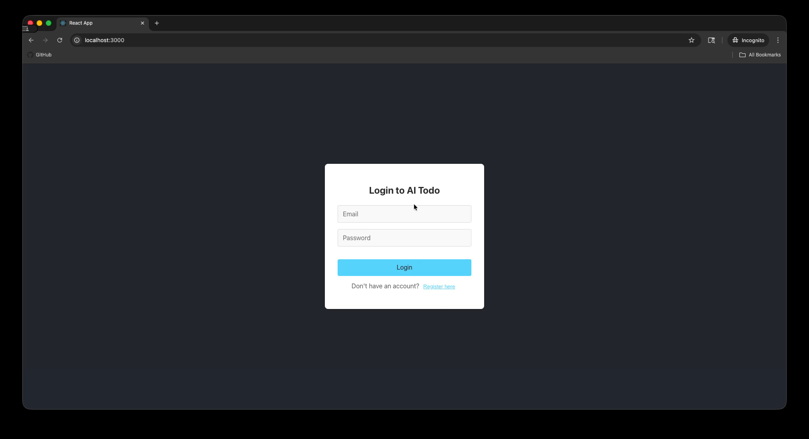

# AI Todo — Frontend

A React frontend for an AI-powered todo app. Set a goal, and Claude (via AWS Bedrock) breaks it down into concrete, actionable tasks. You can then chat with Claude directly about any task to get more details or follow-up help.

## Demo

### Login Functionality

### Remaining features

## Available Scripts

### `npm start`

Runs the app in development mode with hot module replacement.
Open [http://localhost:3000](http://localhost:3000) to view it in the browser.

### `npm run build`

Builds the app for production to the `dist` folder.

### `npm run preview`

Serves the production build locally for testing before deploy.

## Pages

| Page | Path | Description |
|---|---|---|
| Login | `/login` | Sign in to your account |
| Register | `/register` | Create a new account |
| My Goals | `/my-goals` | View all goals and their generated tasks |
| Add Goal | `/add-goals` | Create a new goal and generate tasks with AI |

## Notes

- Requires the backend running at `http://localhost:8000` (see [backend README](https://github.com/ehuberman/aitodo-backend/blob/main/README.md))
- Auth is handled via JWT — token is stored in `localStorage`
- The chat window (`chat-window.jsx`) lets you ask Claude follow-up questions about any task
- Built with Vite; dev server is configured to run on port `3000`
